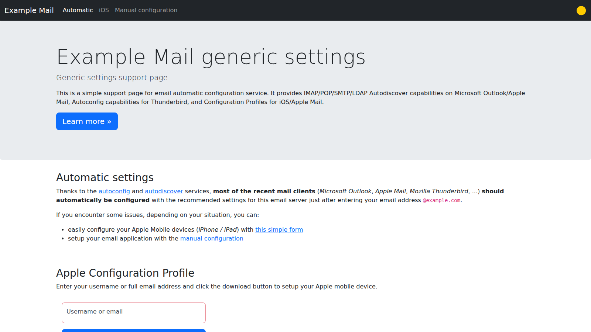
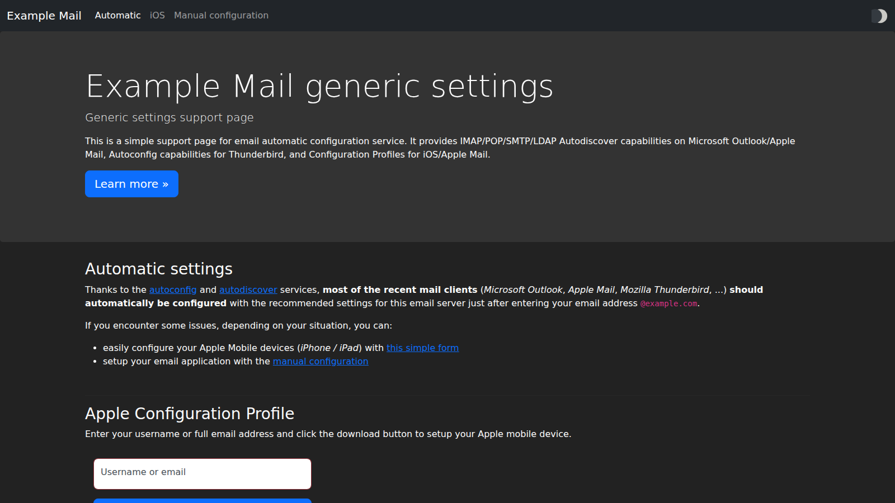
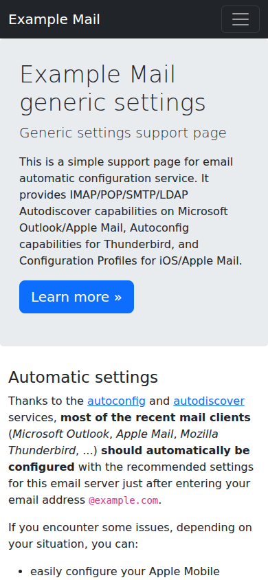
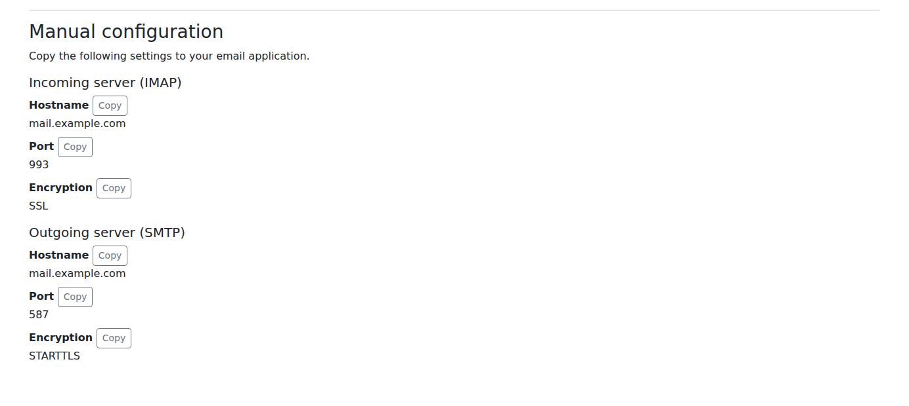

#  Autodiscover Email Settings

[](https://github.com/freifunkMUC/autodiscover-email-settings/actions/workflows/build.yml)
[](https://www.freie-netze.org/autodiscover-email-settings/)

Lets mail clients set up an account from nothing but the address and the password.
The service answers the configuration requests of Thunderbird (autoconfig), Outlook (Autodiscover, including new Outlook's Autodiscover v2) and ActiveSync clients, offers configuration profiles for iPhone, iPad and Mac, and shows a support page with the manual settings.

**Documentation: <https://www.freie-netze.org/autodiscover-email-settings/>**



## Quick start

Point `autoconfig.example.com` and `autodiscover.example.com` at your host, then:

```sh
docker run -d -p 127.0.0.1:8000:8000 \
  -e DOMAIN=example.com \
  -e IMAP_HOST=mail.example.com \
  -e SMTP_HOST=mail.example.com \
  -e POP_HOST= \
  ghcr.io/freifunkmuc/autodiscover-email-settings:latest
```

and put a reverse proxy in front that terminates HTTPS for both names.
The documentation covers [all settings](https://www.freie-netze.org/autodiscover-email-settings/latest/configuration/), [DNS and certificates](https://www.freie-netze.org/autodiscover-email-settings/latest/dns/), [deployment](https://www.freie-netze.org/autodiscover-email-settings/latest/deployment/docker-compose/), what each [mail client](https://www.freie-netze.org/autodiscover-email-settings/latest/clients/thunderbird/) does, and [troubleshooting](https://www.freie-netze.org/autodiscover-email-settings/latest/troubleshooting/).

## Screenshots

| Dark mode | On a phone |
| --- | --- |
|  |  |



## Development

```sh
npm ci
npm run lint
npm test
npm start          # listens on port 8000, configured from the environment
```

The screenshots are taken with [Playwright](https://playwright.dev), from an example configuration that only uses the domains reserved for documentation:

```sh
npx playwright install chromium   # once
npm run screenshots               # writes docs/screenshots/
```

The documentation is built with [MkDocs](https://www.mkdocs.org/) from `docs/`:

```sh
python3 -m venv .venv
.venv/bin/pip install -r requirements-docs.txt
.venv/bin/mkdocs serve
```

## License

Distributed under the [MIT License](LICENSE). This project continues [Monogramm/autodiscover-email-settings](https://github.com/Monogramm/autodiscover-email-settings); see [About](https://www.freie-netze.org/autodiscover-email-settings/latest/about/) for its history and credits.
